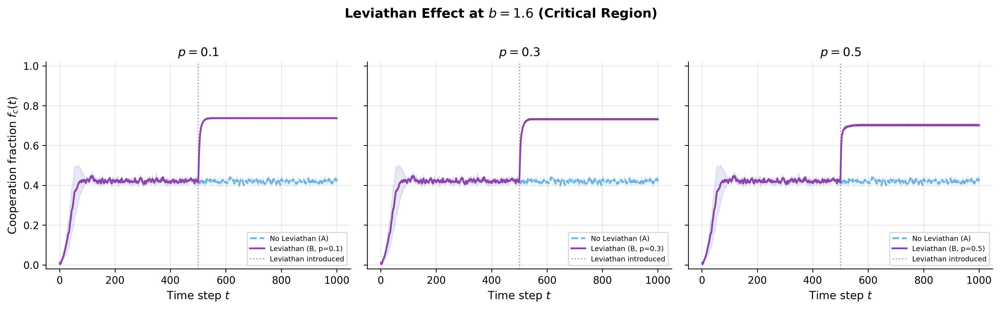

# AI & Computational Modeling Lab

This repository is a curated collection of projects developed for *Artificial Intelligence and Computational Thinking* (Spring 2026). It focuses on network science, PageRank, game theory, and computational social science.

Only original code, selected outputs, and documentation needed to understand the work are included. Course slides, lecture recordings, assigned readings, virtual environments, chat transcripts, and duplicate artifacts are intentionally excluded. HW06 and HW07 were in-class labs rather than standalone assignments, so they are not represented here.

## Projects

| Project | Methods | Highlight |
| --- | --- | --- |
| [HW01: Network visualization](hw01-network-visualization/) | NetworkX, PyVis | Weighted character network and Facebook ego-network |
| [HW02: Network homophily](hw02-network-homophily/) | Ego-network analysis, E-I index, modularity | Gender homophily comparison across 10 ego-networks |
| [HW03: Small-world networks](hw03-small-world-networks/) | Watts-Strogatz, Kleinberg, power-law fitting | 10,000-node lattice experiments |
| [HW04: PageRank](hw04-pagerank/) | Sparse edge arrays, iterative PageRank | Analysis of the Web-Google graph |
| [HW05: Game theory](hw05-game-theory/) | Payoff matrices, Nash equilibria | Two teaching case studies |
| [Final project](final-project/) | Cellular automata, spatial evolutionary games | How centralized punishment changes cooperation dynamics |

## Featured result

The final project compares a spatial Prisoner's Dilemma with and without a centralized punishment mechanism. In the model's intermediate regime (`b = 1.6`), the intervention changes the long-run cooperation rate from roughly 42% to 73%; at higher temptation values (`b >= 1.8`), it fails to restore cooperation.



## Setup

```bash
python -m venv .venv
source .venv/bin/activate
pip install -r requirements.txt
```

Each project directory documents its own data and run instructions. Large public datasets are downloaded from their original providers and are not committed to this repository.

## Reproducibility and responsible use

- Randomized experiments use explicit seeds where supported.
- Published figures are retained as reference outputs; scripts can regenerate them.
- AI tools were used for debugging, code review, and writing assistance. Experimental design, validation, and final interpretation were reviewed by the author.
- HW05 uses subjective utilities for teaching purposes. Its claims are not legal advice, factual adjudications, or forecasts.

## License and data

Original code is released under the [MIT License](LICENSE). Third-party datasets and cited research remain subject to their original terms; see [THIRD_PARTY_NOTICES.md](THIRD_PARTY_NOTICES.md).
