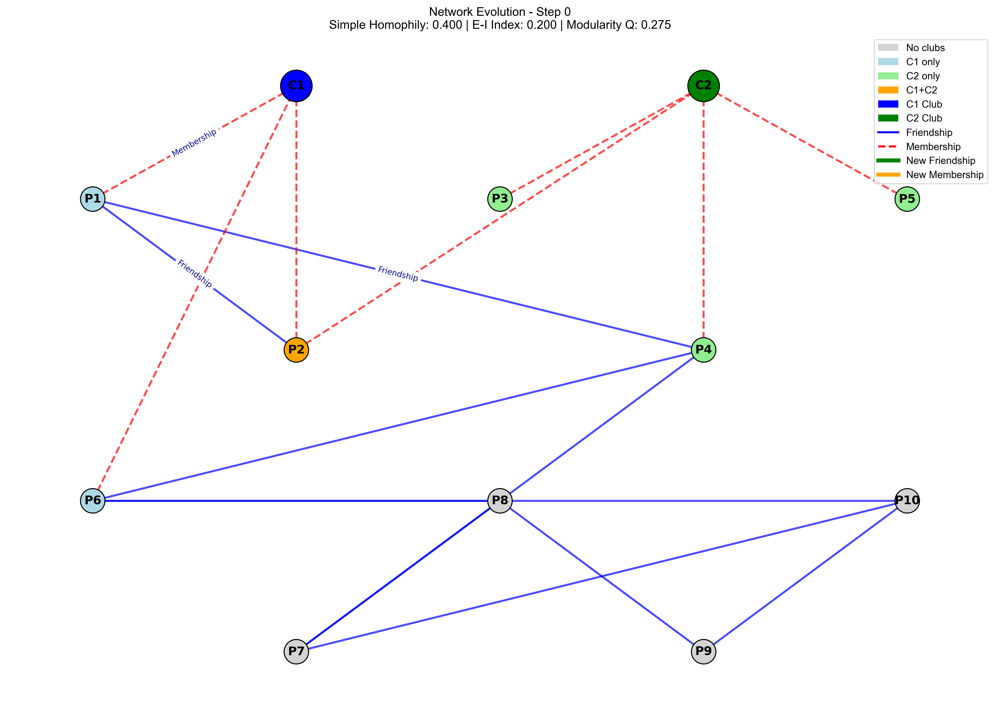
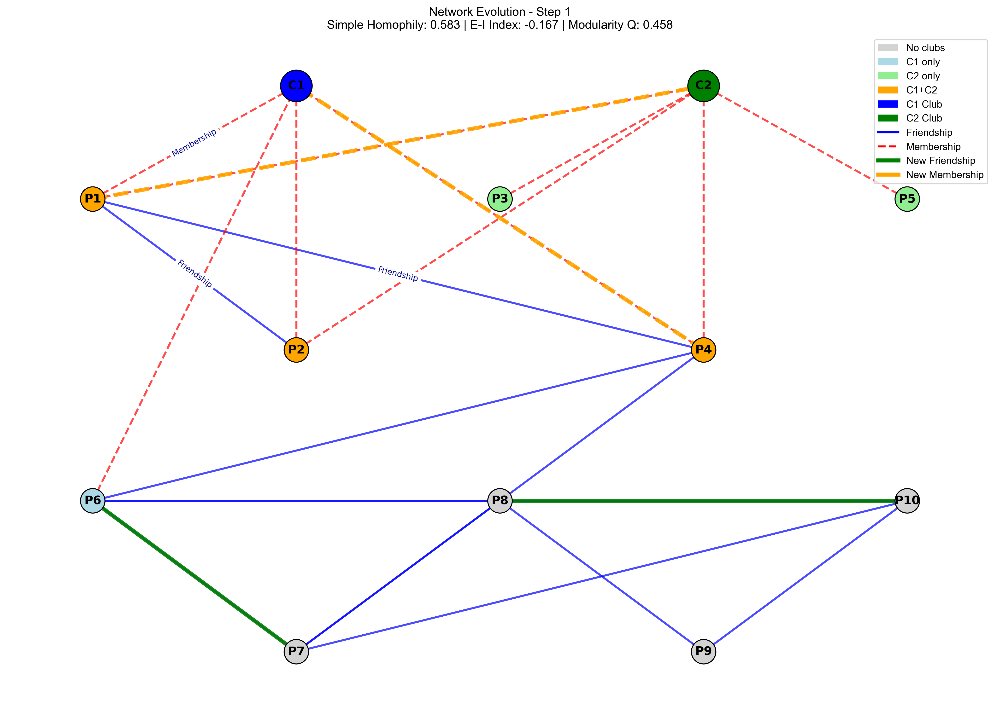
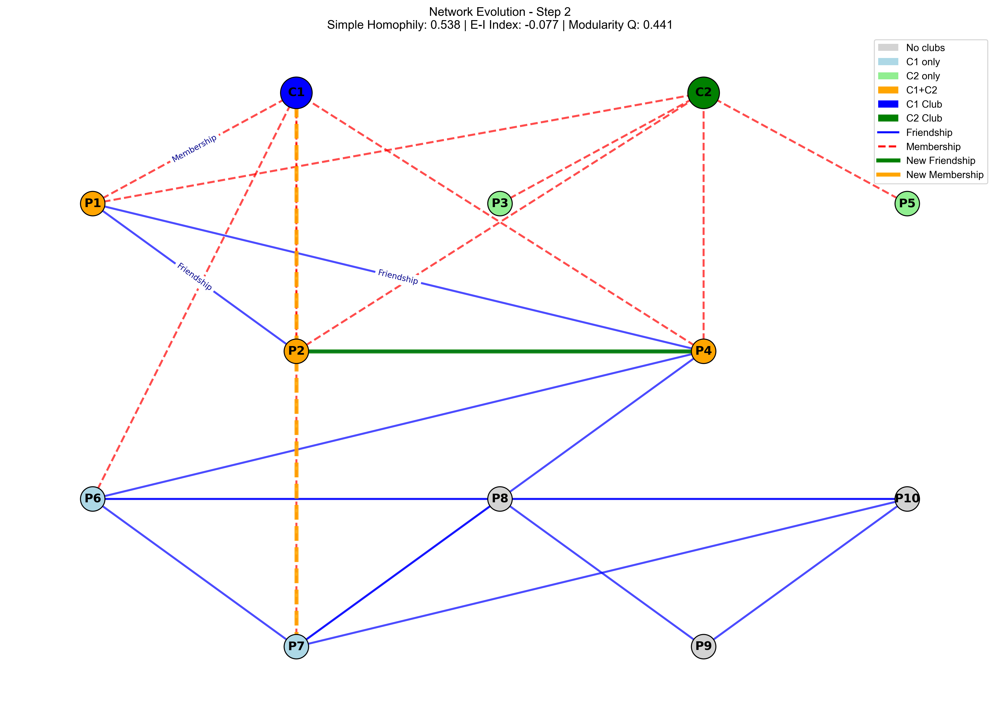
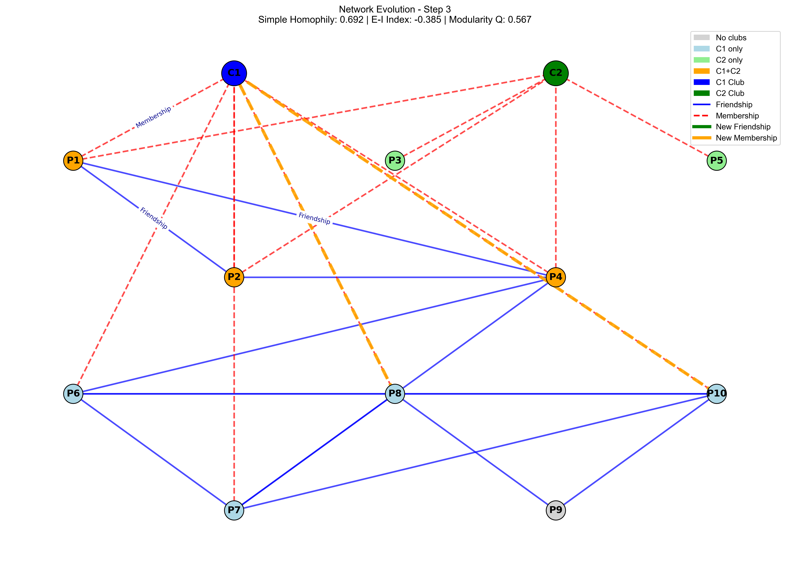
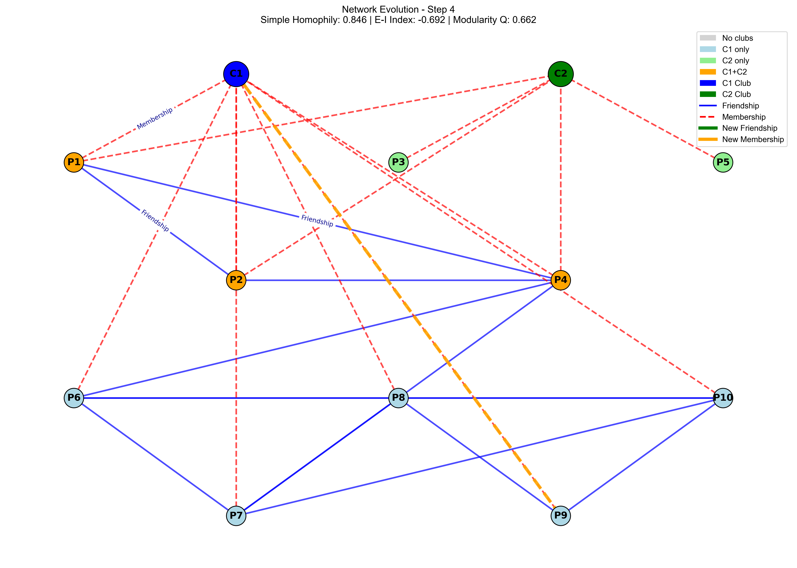
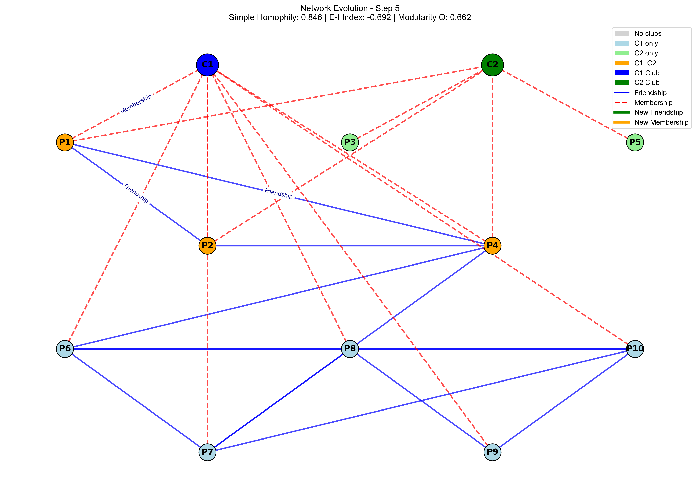

### H2 同质性分析

1. **复现课件中的id=0的ego-network性别同质性分析过程；**
=== 分析 ego ID: 0 ===
有效节点数: 342
有效边数: 2776
同质性比例: 0.5933
期望同质性: 0.5287
同质性指数: 0.0646
结果: 同质性倾向
注：与课件不同的方面在于：
* .egofeat从[0:]开始读向量
* 在计算期望的时候去掉了没有性别特征的节点
* 从.feat中读取全部节点，从.edges里面读取边

2. **分析数据中其他id的ego-network性别同质性，并做一个对比。**

| Ego ID | 有效节点数 | 有效边数 | 同质性 | 期望同质性 | 同质性指数 | 结果 |
|--------|-----------|---------|--------|------------|------------|------|
| 0      | 342       | 2776    | 0.5933 | 0.5287     | 0.0646     | 同质性倾向 |
| 107    | 1034      | 27380   | 0.5777 | 0.5479     | 0.0298     | 同质性倾向 |
| 348    | 225       | 3371    | 0.6873 | 0.6446     | 0.0427     | 同质性倾向 |
| 414    | 154       | 1830    | 0.6333 | 0.5918     | 0.0415     | 同质性倾向 |
| 686    | 163       | 1660    | 0.5584 | 0.5137     | 0.0447     | 同质性倾向 |
| 698    | 65        | 320     | 0.5813 | 0.5342     | 0.0470     | 同质性倾向 |
| 1684   | 777       | 14407   | 0.5729 | 0.5427     | 0.0302     | 同质性倾向 |
| 1912   | 747       | 29858   | 0.5177 | 0.5001     | 0.0176     | 同质性倾向 |
| 3437   | 526       | 4686    | 0.5973 | 0.5235     | 0.0738     | 同质性倾向 |
| 3980   | 58        | 195     | 0.7641 | 0.6165     | 0.1476     | 同质性倾向 |

**统计**：同质性倾向 10 个，异质性倾向 0 个，随机分布 0 个

### H2.1
Initial Network:
Social Network (adjacency matrix):
[[0 1 0 1 0 0 0 0 0 0]
 [1 0 0 0 0 0 0 0 0 0]
 [0 0 0 0 0 0 0 0 0 0]
 [1 0 0 0 0 1 1 0 0 0]
 [0 0 0 0 0 0 0 0 0 0]
 [0 0 0 1 0 0 0 1 0 1]
 [0 0 0 1 0 0 0 1 0 1]
 [0 0 0 0 0 1 1 0 1 0]
 [0 0 0 0 0 0 0 1 0 1]
 [0 0 0 0 0 1 1 0 1 0]]

Club Affiliations:
[[1 0]
 [1 1]
 [0 1]
 [0 1]
 [0 1]
 [1 0]
 [0 0]
 [0 0]
 [0 0]
 [0 0]]

==================================================
Step 0: Initial State
==================================================
* No evolution applied yet
* Homophily measures:
	* Simple=0.400,
	* E-I=0.200,
	* Q=0.275

==================================================
Step 1:
==================================================

New friendships formed: [(6, 7), (8, 10)]
New club participations: [(1, 2), (4, 1)]

Homophily after evolution:
* Simple Homophily: 0.583
  E-I Index: -0.167
  Modularity Q: 0.458
* Homophily changes:
  Simple: +0.183
  E-I: -0.367
  Q: +0.183

==================================================
Step 2:
==================================================

New friendships formed: [(2, 4)]
New club participations: [(7, 1)]

* Homophily after evolution:
  Simple Homophily: 0.538
  E-I Index: -0.077
  Modularity Q: 0.441
* Homophily changes:
  Simple: -0.045
  E-I: +0.090
  Q: -0.017

==================================================
Step 3:
==================================================

No new friendships formed
New club participations: [(8, 1), (10, 1)]

* Homophily after evolution:
  Simple Homophily: 0.692
  E-I Index: -0.385
  Modularity Q: 0.567
* Homophily changes:
  Simple: +0.154
  E-I: -0.308
  Q: +0.126

==================================================
Step 4:
==================================================

No new friendships formed
New club participations: [(9, 1)]

* Homophily after evolution:
  Simple Homophily: 0.846
  E-I Index: -0.692
  Modularity Q: 0.662
* Homophily changes:
  Simple: +0.154
  E-I: -0.308
  Q: +0.095

==================================================
Step 5:
==================================================

No new friendships formed
No new club participations

* Homophily after evolution:
  Simple Homophily: 0.846
  E-I Index: -0.692
  Modularity Q: 0.662
* Homophily changes:
  Simple: +0.000
  E-I: +0.000
  Q: +0.000

Network converged at step 5

=================================================
Final Network State:
==================================================
Social Network (adjacency matrix):
[[0 1 0 1 0 0 0 0 0 0]
 [1 0 0 1 0 0 0 0 0 0]
 [0 0 0 0 0 0 0 0 0 0]
 [1 1 0 0 0 1 1 0 0 0]
 [0 0 0 0 0 0 0 0 0 0]
 [0 0 0 1 0 0 1 1 0 1]
 [0 0 0 1 0 1 0 1 0 1]
 [0 0 0 0 0 1 1 0 1 1]
 [0 0 0 0 0 0 0 1 0 1]
 [0 0 0 0 0 1 1 1 1 0]]

Club Affiliations:
[[1 1]
 [1 1]
 [0 1]
 [1 1]
 [0 1]
 [1 0]
 [1 0]
 [1 0]
 [1 0]
 [1 0]]

* Final Homophily Measures:
  Simple Homophily: 0.846
  E-I Index: -0.692
  Modularity Q: 0.662
* Total Homophily Changes:
  Simple: +0.446
  E-I: -0.892
  Q: +0.387
