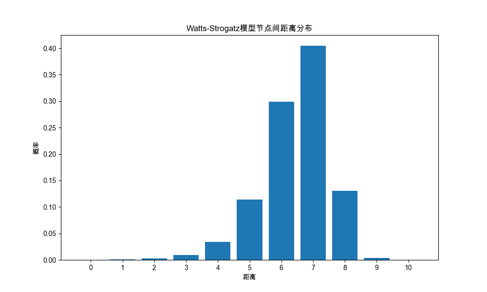
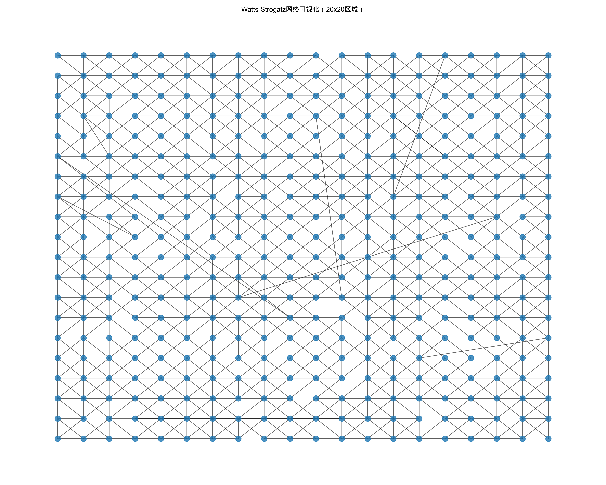
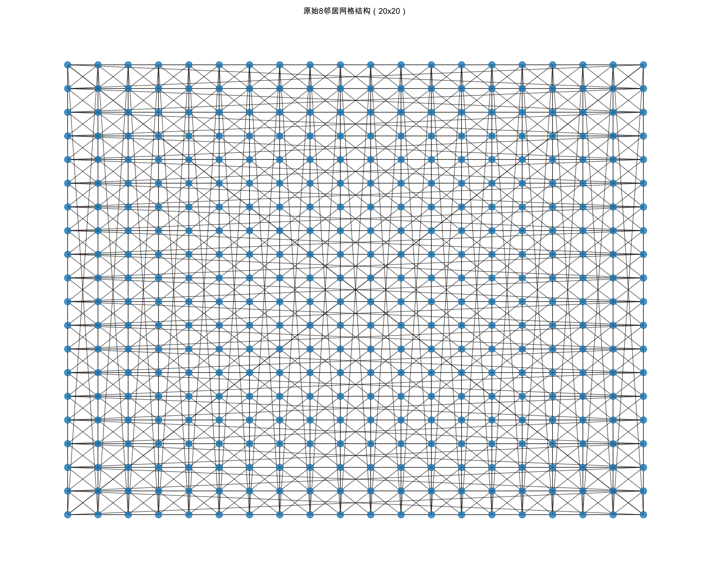
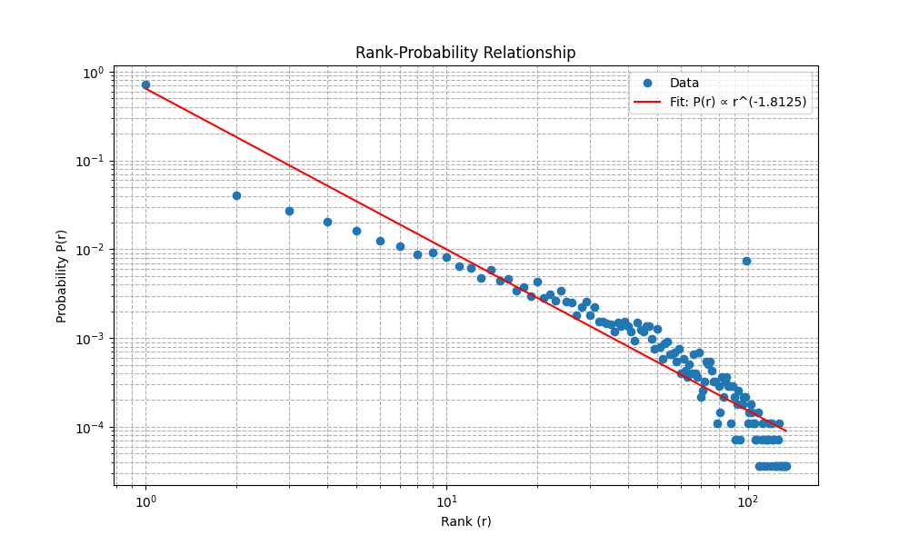

# 1. 复现课堂上WS模型验证过程；
## 构建WS网络
## Watts-Strogatz Network Analysis
- Grid size: 100x100
- Number of nodes: 10000
- Number of edges: 40000
- Average path length: 6.45
- Average clustering coefficient: 0.3171
- Rewiring probability: 0.1

## 计算距离分布
## Distance Distribution
| Distance | Probability |
|----------|-------------|
| 0 | 0.000100 |
| 1 | 0.000800 |
| 2 | 0.002692 |
| 3 | 0.009574 |
| 4 | 0.034433 |
| 5 | 0.113682 |
| 6 | 0.299090 |
| 7 | 0.404704 |
| 8 | 0.131002 |
| 9 | 0.004015 |
| 10 | 0.000007 |

结论：平均路径长度为6.45，短路径(<=10)概率为1，证明任何两个节点之间存在短路径的概率很⾼。

## 可视化网络
## Visualizations
截取20x20的网格制作可视化网络图片

程序还会生成 100*100 网格的交互式可视化网页。由于该 HTML 文件较大，仓库仅保留可重新生成它的代码。

# 2. 用进一步的WSK模型构建社会网络，并抽样验证“朋友关系概率-rank”之间的幂次关系P(r)∝r^(−q) 中q的数值；
## 在alpha=2.0下构建WSK网络
## WSK Network Analysis
- Grid size: 100x100
- Number of nodes: 10000
- Number of edges: 27598
- Clustering exponent alpha: 2.0
- Estimated q value: 1.8125

## 网络可视化
## Network Visualization

## 计算距离分布
## Distance Distribution

结论：短路径概率为1，在WSK模型的建构下，绝大多数节点对之间都存在极短的路径，符合小世界理论。

## 拟合q值
## Rank-Probability Relationship

结论：在双对数坐标下，排名（Rank）与连接概率符合线性关系 ln(P)=−k⋅ln(Rank)+b，其中斜率 k≈0.90625，由此推导出距离指数 q≈1.8125。

## 具体数据取值
## Rank-Probability Data
值得关注的是排名99的节点比排名20的节点连接概率高，这是圆环边界条件导致的，在距离到达边界时，曼哈顿距离因为“绕回”而产生节点重叠。
| Rank | Probability |
|------|-------------|
| 1 | 0.717443 |
| 2 | 0.040909 |
| 3 | 0.026995 |
| 4 | 0.020436 |
| 5 | 0.016306 |
| 6 | 0.012501 |
| 7 | 0.010907 |
| 8 | 0.008733 |
| 9 | 0.009276 |
| 10 | 0.008225 |
| 11 | 0.006450 |
| 12 | 0.006124 |
| 13 | 0.004783 |
| 14 | 0.005870 |
| 15 | 0.004421 |
| 16 | 0.004638 |
| 17 | 0.003406 |
| 18 | 0.003768 |
| 19 | 0.002971 |
| 20 | 0.004348 |
| 21 | 0.002826 |
| 22 | 0.003116 |
| 23 | 0.002645 |
| 24 | 0.003442 |
| 25 | 0.002573 |
| 26 | 0.002500 |
| 27 | 0.001812 |
| 28 | 0.002247 |
| 29 | 0.002573 |
| 30 | 0.001812 |
| 31 | 0.002210 |
| 32 | 0.001522 |
| 33 | 0.001522 |
| 34 | 0.001449 |
| 35 | 0.001413 |
| 36 | 0.001196 |
| 37 | 0.001486 |
| 38 | 0.001377 |
| 39 | 0.001522 |
| 40 | 0.001377 |
| 41 | 0.001196 |
| 42 | 0.000942 |
| 43 | 0.001486 |
| 44 | 0.001232 |
| 45 | 0.001196 |
| 46 | 0.001377 |
| 47 | 0.001377 |
| 48 | 0.000978 |
| 49 | 0.000761 |
| 50 | 0.001268 |
| 51 | 0.000797 |
| 52 | 0.000580 |
| 53 | 0.000870 |
| 54 | 0.000906 |
| 55 | 0.000652 |
| 56 | 0.000652 |
| 57 | 0.000688 |
| 58 | 0.000544 |
| 59 | 0.000761 |
| 60 | 0.000399 |
| 61 | 0.000580 |
| 62 | 0.000435 |
| 63 | 0.000362 |
| 64 | 0.000507 |
| 65 | 0.000399 |
| 66 | 0.000652 |
| 67 | 0.000399 |
| 68 | 0.000362 |
| 69 | 0.000688 |
| 70 | 0.000217 |
| 71 | 0.000254 |
| 72 | 0.000326 |
| 73 | 0.000544 |
| 74 | 0.000507 |
| 75 | 0.000544 |
| 76 | 0.000435 |
| 77 | 0.000326 |
| 78 | 0.000326 |
| 79 | 0.000109 |
| 80 | 0.000290 |
| 81 | 0.000145 |
| 82 | 0.000362 |
| 83 | 0.000217 |
| 84 | 0.000326 |
| 85 | 0.000362 |
| 86 | 0.000290 |
| 87 | 0.000290 |
| 88 | 0.000109 |
| 89 | 0.000290 |
| 90 | 0.000217 |
| 91 | 0.000072 |
| 92 | 0.000181 |
| 93 | 0.000254 |
| 94 | 0.000072 |
| 95 | 0.000181 |
| 96 | 0.000181 |
| 97 | 0.000217 |
| 98 | 0.000217 |
| 99 | 0.007392 |
| 100 | 0.000109 |
| 101 | 0.000145 |
| 102 | 0.000181 |
| 103 | 0.000145 |
| 104 | 0.000109 |
| 105 | 0.000109 |
| 106 | 0.000072 |
| 107 | 0.000072 |
| 108 | 0.000145 |
| 109 | 0.000036 |
| 110 | 0.000036 |
| 111 | 0.000072 |
| 112 | 0.000109 |
| 113 | 0.000036 |
| 114 | 0.000072 |
| 115 | 0.000036 |
| 116 | 0.000072 |
| 117 | 0.000072 |
| 118 | 0.000109 |
| 119 | 0.000036 |
| 120 | 0.000109 |
| 121 | 0.000072 |
| 122 | 0.000072 |
| 123 | 0.000036 |
| 124 | 0.000036 |
| 125 | 0.000036 |
| 126 | 0.000072 |
| 127 | 0.000109 |
| 128 | 0.000036 |
| 129 | 0.000036 |
| 130 | 0.000036 |
| 131 | 0.000036 |
| 132 | 0.000036 |
| 133 | 0.000036 |
| 134 | 0.000036 |
