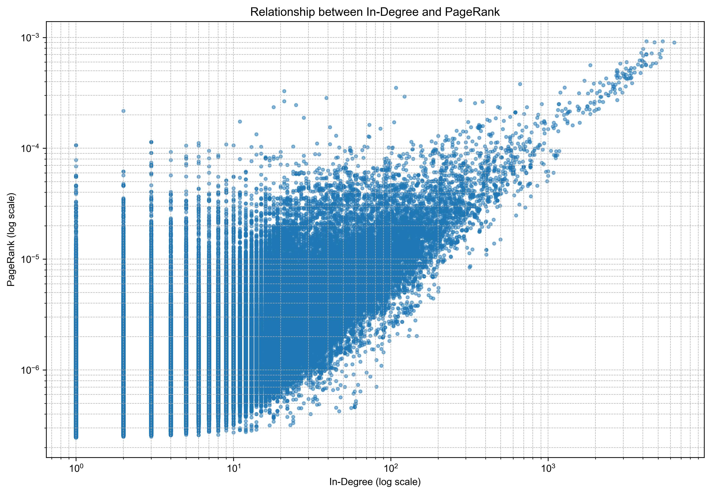

# 运行结果与分析
## 计算pagerank值
Total nodes: 875713
Total edges: 5105039
Top 10 PageRank values:
Node 597621: 0.000924
Node 41909: 0.000921
Node 163075: 0.000904
Node 537039: 0.000899
Node 384666: 0.000787
Node 504140: 0.000765
Node 486980: 0.000725
Node 605856: 0.000718
Node 32163: 0.000713
Node 558791: 0.000709
分析：** 输出节点数、Pagerank值排序前10的节点以及值 ** 可以看出，Pagerank值最高的节点是597621，Pagerank值最低的节点是558791。而具体的Pagerank值，因为web-google的节点数量N大，所以哪怕是得分最高的节点，具体分数也只是10^(-4)量级。

## 节点入度与pagerank值的关系可视化

分析：** 可视化节点入度与pagerank值的关系 ** x,y轴是对数化的节点入度与Pagerank值，X 与 Y 基本上正相关，但是条件方差 $D(Yi|Xi)$ 随着i增大(X增大)而减少​。即当节点入度较小时，Pagerank的值可能比较大也可能比较小，Pagerank值主要被链入的网页分数决定，但是当入度较大时，Pagerank值也普遍高，体现一种被普遍认可的权威性。整体体现了算法的特性，即Pagerank并非简单的入度计数，而是带权重的重要性传播，因此入度相同的节点，PR可以差异巨大。


# 程序说明
## 程序架构

该程序采用模块化设计，主要包含以下几个部分：

1. **导入模块**：导入必要的库（numpy、sys、matplotlib）
2. **数据读取模块**：`read_graph`函数，负责读取和处理图数据
3. **PageRank计算模块**：`pagerank`函数，实现核心的PageRank算法
4. **可视化模块**：`visualize_in_degree_vs_pagerank`函数，展示入度与PageRank值的关系
5. **辅助函数**：`set_font`函数，处理中文字体显示问题
6. **主程序**：调用上述函数完成整个计算和可视化流程

## 详细函数分析
### 1. `read_graph(file_path, max_lines=None)`

**功能**：读取图数据文件，构建优化的邻接表和节点列表
**参数**：
- `file_path`：图数据文件路径
- `max_lines`：可选参数，限制读取的行数，默认读取所有行
**内部操作**：
1. 第一次扫描文件，使用集合收集所有唯一节点
2. 为每个节点分配唯一索引，用字典构建节点到索引的映射
3. 第二次扫描文件，构建边的索引列表和计算节点的入度、出度
4. 将边的索引列表转换为numpy数组以提高计算效率
**返回值**：
- `from_indices`：源节点索引的numpy数组
- `to_indices`：目标节点索引的numpy数组
- `out_degrees`：节点出度的numpy数组
- `in_degrees`：节点入度的numpy数组
- `nodes`：排序后的节点列表
- `node_to_index`：节点到索引的映射字典

### 2. `pagerank(from_indices, to_indices, out_degrees, in_degrees, nodes, node_to_index, s=0.85, max_iterations=100, tolerance=1e-6)`
**功能**：计算每个节点的PageRank值，实现"同比缩减，等量补偿"功能
* 初始化PR值：将所有节点的初始PR值设为( 1/N )，符合均匀分布假设。
* 识别sink节点：sink节点的出度为0，无法通过出边传递PR值，需要特殊处理。
* 预计算权重：提前计算每条边的权重( 1/C(v) )，避免重复计算。
* 保存旧PR值：用于后续计算收敛条件。
* 计算sink节点的PR贡献：sink节点的PR值无法通过出边传递，因此需要将其PR值平均分配给所有节点（对应公式中隐含的sink节点处理）。
* 使用边索引数组（并没有用特征矩阵，边索引数组只存真实存在的边的贡献）计算边的贡献：
对于每条边( v \rightarrow u )，节点( v )的PR贡献为( d \times \frac{PR(v)}{C(v)} )。
代码中通过向量化操作计算所有边的贡献：edge_contributions = s * pr[from_indices] * weights（其中( s = d )）。
使用np.add.at(new_pr, to_indices, edge_contributions)将贡献累加到对应目标节点。
* 处理sink节点和随机跳转：将所有sink节点的PR值平均分配给所有节点，然后为每个节点添加随机跳转的PR值。
* 检查收敛：当PR值的变化小于阈值时，停止迭代。
初始化PageRank值为均匀分布。进入迭代循环，最多执行max_iterations次。每次迭代：保存当前PageRank值。计算新的PageRank值。计算新旧值之间的差异。如果差异小于阈值（默认为1e-6），退出循环。返回最终的PageRank值。
**参数**：
- `from_indices`：源节点索引数组
- `to_indices`：目标节点索引数组
- `out_degrees`：节点出度数组
- `in_degrees`：节点入度数组
- `nodes`：节点列表
- `node_to_index`：节点到索引的映射
- `s`：阻尼因子，默认0.85
- `max_iterations`：最大迭代次数，默认100
- `tolerance`：收敛阈值，默认1e-6
**内部操作**：
1. 初始化PageRank值为均匀分布
2. 预计算sink节点（出度为0的节点）的索引
3. 预计算每条边的权重
4. 迭代计算PageRank值：
   - 计算sink节点的PR贡献
   - 使用向量化操作计算边的贡献
   - 处理sink节点和随机跳转
   - 检查收敛条件
5. 构建节点到PageRank值的映射
**返回值**：
- `result`：节点到PageRank值的字典
- `in_degrees`：节点入度数组（传递回主程序用于可视化）

### 3. `set_font()`
**功能**：根据操作系统设置合适的中文字体，确保图表中文显示正常
**参数**：无
**内部操作**：
- 检测操作系统类型
- 根据不同操作系统设置对应的中文字体
**返回值**：无

### 4. `visualize_in_degree_vs_pagerank(in_degrees, pr_values, nodes, node_to_index)`
**功能**：可视化节点入度与PageRank值的关系
**参数**：
- `in_degrees`：节点入度数组
- `pr_values`：节点PageRank值字典
- `nodes`：节点列表
- `node_to_index`：节点到索引的映射
**内部操作**：
1. 调用`set_font()`设置中文字体
2. 收集每个节点的入度和PageRank值
3. 创建散点图，使用对数刻度
4. 设置图表标题、坐标轴标签和网格
5. 保存图表为PNG文件
6. 显示图表
**返回值**：无

## 主程序流程
1. 调用`read_graph`读取图数据
2. 打印节点总数和边总数
3. 调用`pagerank`计算PageRank值
4. 打印PageRank值前10的节点
5. 调用`visualize_in_degree_vs_pagerank`生成并显示可视化图表

## 数据流

```
web-Google.txt → read_graph → (from_indices, to_indices, out_degrees, in_degrees, nodes, node_to_index)
                                                                       ↓
                                                     pagerank → (pr_values, in_degrees)
                                                                       ↓
                                              visualize_in_degree_vs_pagerank → 生成图表
```

## 技术特点
1. **内存优化**：使用numpy数组存储数据，避免构建大型邻接矩阵
2. **计算加速**：使用向量化操作（如`np.add.at`）替代Python循环
3. **可扩展性**：支持处理大型图数据，如web-Google数据集
4. **可视化**：提供直观的散点图展示入度与PageRank值的关系
5. **鲁棒性**：处理sink节点和收敛判断，确保算法稳定运行

## 性能分析
### 时间复杂度
- **读取数据**：O(m)，其中m是边数（5105039）
- **PageRank计算**：O(k*m)，其中k是迭代次数（通常在30-50次之间）
- **总时间复杂度**：O(m + k*m) = O(k*m)
### 内存复杂度
- **存储边**：O(m)，使用两个numpy数组存储边的索引
- **存储节点信息**：O(n)，其中n是节点数（875713）
- **总内存复杂度**：O(n + m)，远低于邻接矩阵的O(n²)
